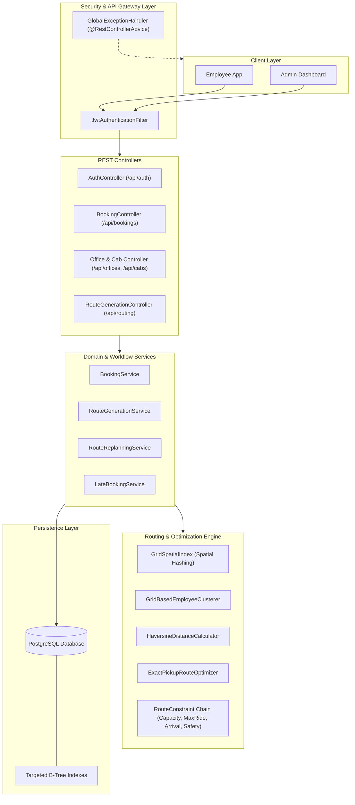
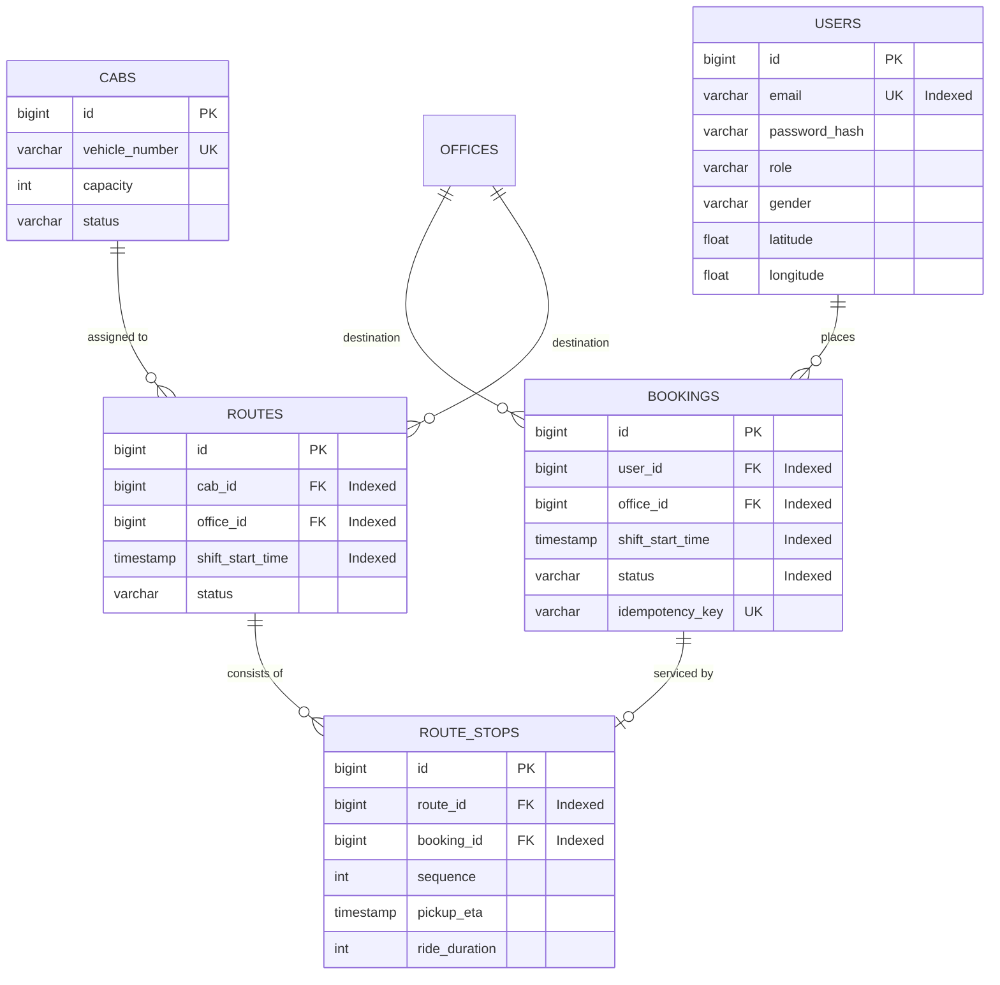
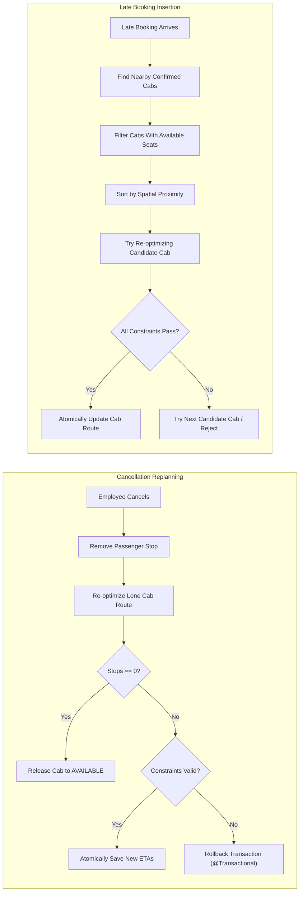

# SmartCab — Corporate Cab Pooling & Smart Routing System

> Production-ready, backend-only corporate cab pooling and route optimization engine built with Spring Boot 3 / 4, PostgreSQL, and Spring Security.

---

## 1. Project Overview

**SmartCab** is an enterprise transit routing backend designed for organizations managing high-volume employee transportation. It automates:
- Employee booking intake with spatial coordinates and shift scheduling.
- Vehicle fleet allocation across multi-capacity cabs (4 and 6 seaters).
- Near-optimal vehicle pooling using spatial grid indexing.
- Exact route permutation sequencing, ETA calculation, and constraint satisfaction.
- Mandatory night-shift women employee safety safeguards.
- Dynamic route recovery for cancellations and late booking arrivals.

---

## 2. Problem Statement

Corporate employee transport faces conflicting operational and human constraints:
1. **Capacity & Fleet Utilization:** Vehicles must be filled efficiently without exceeding physical seat capacity.
2. **Commute Fatigue:** Individual employee ride time cannot exceed a maximum duration threshold (e.g., 60 minutes).
3. **Punctuality:** Cabs must arrive at the office strictly on or before the shift start time.
4. **Safety & Compliance:** A woman employee must not be the first pickup alone during night hours (`20:00`–`06:00`).
5. **Real-time Volatility:** Route plans must withstand last-minute cancellations and late booking arrivals without disrupting unrelated vehicles.

---

## 3. Key Features

- **JWT-Secured REST APIs:** Role-based access control (`EMPLOYEE` vs `ADMIN`).
- **Spatial Grid Clustering:** Polynomial-time spatial indexing instead of $\mathcal{O}(n^2)$ pairwise distance calculations.
- **Exact Per-Cab Optimization:** Exhaustive permutation search for cab-sized groups ($k \le 6$) guaranteeing the shortest valid route.
- **Hard Constraint Engine:** Validates cab capacity, maximum individual ride time, on-time office arrival, and night safety rules.
- **Escort Guard Escalation:** Automatically reorders mixed-gender pickups or allocates a physical security escort guard (occupying 1 seat) during night shifts.
- **Localized Replanning:** Re-optimizes only the affected cab when an employee cancels or books late; unrelated vehicles remain untouched.
- **Database-Level Idempotency:** Eliminates duplicate bookings through unique idempotency keys and active booking composite indexes.
- **Centralized RFC-7807 Error Handling:** Standardized error responses with zero stack trace or SQL leakage.

---

## 4. Architecture



---

## 5. Technology Stack

- **Framework:** Spring Boot 4.1.1 / Java 23
- **Security:** Spring Security 6 with JJWT (`io.jsonwebtoken 0.12.6`)
- **Persistence:** Spring Data JPA / Hibernate ORM 7
- **Database:** PostgreSQL 18
- **Validation:** Jakarta Bean Validation (`hibernate-validator`)
- **Build Tool:** Apache Maven Wrapper (`mvnw`)
- **Testing:** JUnit 5, MockMvc, Spring Security Test, AssertJ

---

## 6. Authentication & Authorization

All endpoints (except `/api/auth/**` and Actuator health) require a valid JWT passed in the HTTP Authorization header: `Authorization: Bearer <token>`.

| Role | Access Permissions |
| :--- | :--- |
| `EMPLOYEE` | Create bookings, view own bookings, cancel own bookings, list offices. |
| `ADMIN` | Manage offices, manage cabs, generate batch routes, insert late bookings, inspect all bookings/routes. |

Passwords are encrypted with BCrypt (strength 10). User responses strictly sanitize hashes and sensitive credentials.

---

## 7. Database Schema & Indexing



### Targeted Indexes & Rationale

1. `users.email` (`idx_users_email`): Fast B-tree point lookup on every authenticated request and registration check.
2. `bookings (user_id, created_at DESC)` (`idx_bookings_user_created_at`): Direct index-ordered scan for employee booking history without sorting overhead.
3. `bookings (office_id, shift_start_time, status)` (`idx_bookings_office_shift_status`): Accelerates grouping of pending bookings during batch route generation.
4. `bookings (user_id, office_id, shift_start_time, status)` (`idx_bookings_user_office_shift_status`): O(log N) verification of active duplicate bookings for the same shift.
5. `routes (cab_id)` (`idx_routes_cab_id`): Foreign key index preventing sequential table scans when joining routes and cabs.
6. `routes (office_id, shift_start_time, status)` (`idx_routes_office_shift_status`): Powers candidate route lookups for dynamic late booking insertion.
7. `route_stops (route_id, sequence ASC)` (`idx_route_stops_route_sequence`): Index-ordered retrieval of pickup stops in execution sequence.
8. `route_stops (booking_id)` (`idx_route_stops_booking_id`): O(1) stop mapping when an employee cancels a booking.

---

## 8. API Reference

### Authentication
- `POST /api/auth/register` — Register a new user (`EMPLOYEE` by default).
- `POST /api/auth/login` — Authenticate and receive a JWT token.

### Offices & Cabs (Admin)
- `POST /api/offices` — Register an office location.
- `GET /api/offices` — List active offices.
- `GET /api/offices/{id}` — Get office by ID.
- `POST /api/cabs` — Register a vehicle (capacity: 4 or 6).
- `GET /api/cabs` — List cabs.

### Bookings (Employee & Admin)
- `POST /api/bookings` — Create a shift booking (supports `Idempotency-Key` header).
- `GET /api/bookings` — List current employee's bookings (or all for Admin).
- `GET /api/bookings/{id}` — Get booking details (enforces user ownership).
- `DELETE /api/bookings/{id}` — Cancel a booking and trigger local route replanning.

### Routing (Admin)
- `POST /api/routing/generate` — Generate optimized cab routes for pending bookings.
- `POST /api/routing/late-booking/{bookingId}` — Dynamically insert a late booking into an existing route.

---

## 9. Employee Clustering & Spatial Grid

### Why Not Naive $\mathcal{O}(n^2)$ Pairwise Comparison?
Computing pairwise distances between every pair of $n$ bookings requires $\frac{n(n-1)}{2}$ trigonometric distance evaluations. At $n = 5{,}000$, that requires $\approx 12.5$ million calculations per shift.

### Spatial Grid Hashing
SmartCab implements a 2D spatial grid index:
- Geographic coordinates are mapped to discrete grid cells:
  $$\text{cellX} = \lfloor \text{lat} / \Delta_{\text{deg}} \rfloor, \quad \text{cellY} = \lfloor \text{lon} / \Delta_{\text{deg}} \rfloor$$
  where $\Delta_{\text{deg}} \approx \text{detourKm} / 111.0\text{ km}$.
- Insertion takes $\mathcal{O}(1)$ time into a hash table of buckets.
- Radius search queries only the target cell and its 8 immediate neighboring cells.
- Candidate clustering runs in expected $\mathcal{O}(n)$ time.

---

## 10. Distance Calculation: Haversine vs. Actual Road Distance

Distances between pickup stops and offices are calculated using the great-circle **Haversine formula**:
$$d = 2R \arcsin\left(\sqrt{\sin^2\left(\frac{\Delta\phi}{2}\right) + \cos(\phi_1)\cos(\phi_2)\sin^2\left(\frac{\Delta\lambda}{2}\right)}\right)$$
where $R = 6{,}371\text{ km}$.

> [!NOTE]
> **Engineering Reality & Heuristic Disclaimer:**
> Haversine calculates spherical straight-line distance, not actual driving path. Real-world urban routing has one-way streets, traffic congestion, and physical barriers.
> - **Why used:** Zero external network latency, microsecond execution, zero cost, completely deterministic for unit testing and offline planning.
> - **Production Bridge:** In production, Haversine serves as the fast first-stage spatial filter. Candidate routes can then query an OSRM or Google Distance Matrix matrix provider before final persistence.

---

## 11. Route Optimization & Why Exact Search is Feasible

### The Vehicle Routing Problem (VRP) is NP-Hard
The general Capacitated Vehicle Routing Problem (CVRP) is strictly NP-hard. We make **no claim** of global optimality across the entire multi-vehicle fleet.

### The Two-Phase Heuristic
SmartCab uses an industry-standard decomposition:
1. **Phase 1 (Polynomial Spatial Clustering):** Fast heuristic grouping of $n$ employees into cab-sized clusters of size $k \le \text{cabCapacity}$ using spatial hashing.
2. **Phase 2 (Exact Intra-Cab Permutation Search):** For each single cab group, find the *provably optimal* pickup sequence.

### Feasibility of Exhaustive Permutation Search for $k \le 6$
Standard corporate cabs carry 4 or 6 passengers:
- For $k = 4$: $4! = 24$ permutations.
- For $k = 6$: $6! = 720$ permutations.

Evaluating 720 permutations against travel duration, ETAs, and constraints takes **$< 1\text{ millisecond}$** on a modern CPU. Therefore, exhaustive search inside a single vehicle is not only feasible, but guarantees the shortest valid intra-cab route without heuristic approximations.

---

## 12. Maximum Ride-Time & Arrival Enforcement

- **Office Arrival Constraint:** The cab must arrive at the office on or before `shiftStartTime`:
  $$\text{Office ETA} \le \text{Shift Start Time}$$
- **Working-Backward ETAs:** Starting from `officeEta`, pickup ETAs are propagated backwards leg by leg:
  $$\text{ETA}_{i} = \text{ETA}_{i+1} - \frac{\text{Distance}(i, i+1)}{\text{AverageSpeed}}$$
- **Maximum Ride Time Constraint:** Each passenger's in-vehicle duration is strictly checked:
  $$\text{RideDuration}_i = \text{Office ETA} - \text{ETA}_i \le \text{MaxRideTimeMinutes}$$
If any passenger's ride time exceeds the limit, that permutation is marked invalid.

---

## 13. Night Safety Rule & Multi-Tier Resolution

> *"A woman employee must not be the first pickup or the last drop alone during night hours."*

### Operational Interpretation of "Alone"
On inbound trips to the office, the vehicle starts empty. The first boarded passenger travels unaccompanied by any colleagues until the second passenger is picked up. If that passenger is female and travel occurs during night hours (`20:00`–`06:00`), she is considered alone with the driver.

### 3-Tier Multi-Phase Resolution
1. **Phase 1 (Unescorted Reordering — Zero Cost):**
   The optimizer searches all $k!$ permutations for a valid ordering where a male colleague is picked up first (`[Male, Female] -> Office`). If valid under all constraints, this safe route is selected without additional personnel.
2. **Phase 2 (Security Escort Guard Allocation):**
   If all valid permutations start with a female employee (e.g., all passengers are women), the system attempts to allocate an escort guard (`hasEscortGuard = true`).
   - The security guard consumes **1 physical seat** in the cab.
   - Guard allocation is valid only if:
     $$\text{Passengers} + 1 \le \text{Cab Capacity}$$
3. **Phase 3 (Rejection — Never Silently Violate):**
   If 4 female employees are in a 4-seater cab, an escort guard cannot fit ($4 + 1 = 5 > 4$). The candidate route is rejected (`Optional.empty()`), requiring an operational vehicle split rather than violating employee safety.

---

## 14. Dynamic Operations: Cancellation & Late Booking



### Localized Replanning Guarantees
- Both operations are `@Transactional`.
- **Zero Cross-Fleet Ripple:** Only the cab directly assigned to the passenger is touched. All other vehicles and routes remain unmodified.
- If replanning after cancellation violates constraints for remaining passengers, the transaction rolls back cleanly with `422 Unprocessable Entity`.

---

## 15. Duplicate Booking & Idempotency

1. **Client-Driven Idempotency:**
   Clients submit an `Idempotency-Key` header (or request body field). The `idempotency_key` column has a unique database constraint. Re-submitting the same key returns the existing booking without creating duplicates.
2. **Active Booking Validation:**
   The repository executes `existsByUserIdAndOfficeIdAndShiftStartTimeAndStatusNot(userId, officeId, shiftStartTime, CANCELLED)`.
   - Prevents an employee from having concurrent active bookings for the same shift.
   - **Why unconditional UNIQUE(user, office, shift) was avoided:** When an employee cancels, their booking status becomes `CANCELLED`. Employees are legally allowed to re-book for the same shift later. A hard unconditional composite database constraint would prevent re-booking.
   - High-speed lookup is achieved via the composite index `idx_bookings_user_office_shift_status`.

---

## 16. Centralized Error Handling

Implemented via `@RestControllerAdvice` in `GlobalExceptionHandler`:
- Standardized RFC-7807 JSON error format:
  ```json
  {
    "timestamp": "2026-09-24T02:25:00.000",
    "status": 409,
    "error": "Conflict",
    "errorCode": "DUPLICATE_BOOKING",
    "message": "Active booking already exists for this employee, office, and shift start time",
    "path": "/api/bookings"
  }
  ```
- **Error Code Catalog:** `VALIDATION_ERROR` (400), `AUTHENTICATION_ERROR` (401), `ACCESS_DENIED` (403), `RESOURCE_NOT_FOUND` (404), `DUPLICATE_RESOURCE` / `DUPLICATE_BOOKING` / `DATABASE_CONSTRAINT_VIOLATION` (409), `INVALID_ROUTE` (422), `INTERNAL_SERVER_ERROR` (500).
- **Security:** Stack traces, internal Java package names, and raw SQL queries are intercepted and sanitized before transmission.

---

## 17. Monitoring & Observability

- **Spring Boot Actuator:** Exposed at `/actuator/health` and `/actuator/info`.
- **Health Checks:** Validates PostgreSQL database connectivity and Hikari connection pool status.
- **Structured Logging:** SLF4J / Logback logging with transaction boundaries across routing and cancellation workflows.

---

## 18. Caching & Why Redis is Optional for Correctness

- **Why Redis is Optional for Correctness:**
  SmartCab's state correctness (seats, routes, duplicate prevention) is strictly enforced by PostgreSQL transaction isolation (`@Transactional`, row locks, and unique indexes). Adding Redis for write transactions introduces dual-write hazards and cache invalidation complexity without correctness benefits.
- **Where Redis Adds Value (Scale):**
  1. Office metadata and shift master data caching (`@Cacheable("offices")`).
  2. Distributed lock coordination across multiple API nodes during fleet-wide batch route generation.
  3. Precomputed distance matrix caching for frequently traveled coordinate pairs.

---

## 19. Time & Space Complexity

| Operation | Time Complexity | Space Complexity | Explanation |
| :--- | :--- | :--- | :--- |
| Spatial Grid Indexing | $\mathcal{O}(n)$ | $\mathcal{O}(n)$ | Constant time bucket insertion for $n$ employee bookings. |
| Employee Clustering | $\mathcal{O}(n)$ expected | $\mathcal{O}(n)$ | Queries 9 adjacent grid buckets per employee; linear expected time. |
| Intra-Cab Route Optimization | $\mathcal{O}(k! \cdot k)$ | $\mathcal{O}(k)$ | Exhaustive permutation of $k \le 6$ stops ($\le 720$ checks). |
| Full Batch Generation | $\mathcal{O}(n + m \cdot k! \cdot k)$ | $\mathcal{O}(n)$ | $m$ clusters assigned to cabs; runs in sub-second time for $n = 10{,}000$. |
| Dynamic Replanning | $\mathcal{O}(k! \cdot k)$ | $\mathcal{O}(k)$ | Only 1 cab route re-evaluated; completely isolated from $n$. |
| Late Booking Insertion | $\mathcal{O}(C \cdot k! \cdot k)$ | $\mathcal{O}(k)$ | Evaluates $C$ candidate cabs with available seats. |

---

## 20. Design Trade-Offs & Known Limitations

1. **Haversine vs Real-world Street Networks:**
   - *Trade-off:* Haversine executes instantaneously offline without API rate limits or cost.
   - *Limitation:* Does not account for turn restrictions, bridges, traffic jams, or natural obstacles.
2. **Decomposition vs Global VRP:**
   - *Trade-off:* Clustering followed by exact intra-cab sequencing provides predictability, fast execution, and guaranteed safety constraint validation.
   - *Limitation:* Does not guarantee mathematical global fleet distance minimization across cabs (which is NP-hard).
3. **Database Concurrency vs Distributed In-Memory State:**
   - *Trade-off:* ACID guarantees via PostgreSQL ensure zero corrupted routes or double-assigned seats.
   - *Limitation:* High write concurrency under multi-node deployment requires database row-level locking or optimistic retry mechanisms.

---

## 21. Setup Instructions

### Prerequisites
- **Java Development Kit (JDK):** Version 23 or 21
- **Database:** PostgreSQL (local or Docker)
- **Maven:** Bundled `./mvnw` wrapper

### PostgreSQL Configuration
Create the database in PostgreSQL:
```sql
CREATE DATABASE smartcab;
```

Update your `src/main/resources/application.properties` (or set environment variables):
```properties
spring.datasource.url=jdbc:postgresql://localhost:5432/smartcab
spring.datasource.username=postgres
spring.datasource.password=your_password
spring.jpa.hibernate.ddl-auto=update
```

### Running the Application
```bash
# Using Maven wrapper (Windows)
.\mvnw.cmd spring-boot:run

# Using Maven wrapper (Linux/macOS)
./mvnw spring-boot:run
```
The server starts on port `8081` (configurable via `server.port`).

---

## 22. Running Tests

Run the complete automated test suite (82 unit, integration, and security tests):
```bash
.\mvnw.cmd test
```

### Quality Verification
```
[INFO] Results:
[INFO] 
[INFO] Tests run: 82, Failures: 0, Errors: 0, Skipped: 0
[INFO] 
[INFO] BUILD SUCCESS
```

---

## 23. Sample API Calls & Demo

### 1. Register & Login Admin
```bash
# Register Admin
curl -X POST http://localhost:8081/api/auth/register \
  -H "Content-Type: application/json" \
  -d '{"name":"Admin User","email":"admin@smartcab.com","password":"adminPassword123","gender":"MALE","role":"ADMIN"}'

# Login Admin
curl -X POST http://localhost:8081/api/auth/login \
  -H "Content-Type: application/json" \
  -d '{"email":"admin@smartcab.com","password":"adminPassword123"}'
# Response contains: {"token": "eyJhbGciOi..."}
```

### 2. Create Office & Cab
```bash
# Create Office
curl -X POST http://localhost:8081/api/offices \
  -H "Authorization: Bearer <ADMIN_TOKEN>" \
  -H "Content-Type: application/json" \
  -d '{"name":"EcoWorld Campus","address":"Outer Ring Road, Bangalore","latitude":12.9234,"longitude":77.6852}'

# Create 4-seater Cab
curl -X POST http://localhost:8081/api/cabs \
  -H "Authorization: Bearer <ADMIN_TOKEN>" \
  -H "Content-Type: application/json" \
  -d '{"vehicleNumber":"KA-01-AB-1001","capacity":4,"status":"AVAILABLE"}'
```

### 3. Register Employees & Book Cabs
```bash
# Register Female Employee
curl -X POST http://localhost:8081/api/auth/register \
  -H "Content-Type: application/json" \
  -d '{"name":"Alice","email":"alice@smartcab.com","password":"password123","gender":"FEMALE","latitude":12.9352,"longitude":77.6245}'

# Login Alice
curl -X POST http://localhost:8081/api/auth/login \
  -H "Content-Type: application/json" \
  -d '{"email":"alice@smartcab.com","password":"password123"}'

# Create Booking (Night Shift)
curl -X POST http://localhost:8081/api/bookings \
  -H "Authorization: Bearer <ALICE_TOKEN>" \
  -H "Content-Type: application/json" \
  -d '{"officeId":1,"shiftStartTime":"2026-10-01T22:00:00"}'
```

### 4. Trigger Route Generation
```bash
curl -X POST http://localhost:8081/api/routing/generate \
  -H "Authorization: Bearer <ADMIN_TOKEN>" \
  -H "Content-Type: application/json" \
  -d '{"cabCapacity":4,"maxRideTimeMinutes":60,"maxDetourKm":5.0}'
```

### 5. Cancel Booking (Dynamic Replanning)
```bash
curl -X DELETE http://localhost:8081/api/bookings/1 \
  -H "Authorization: Bearer <ALICE_TOKEN>"
```

### 6. Insert Late Booking
```bash
curl -X POST http://localhost:8081/api/routing/late-booking/2 \
  -H "Authorization: Bearer <ADMIN_TOKEN>"
```

---

## 24. License
Developed as an engineering case study for corporate transit management.
